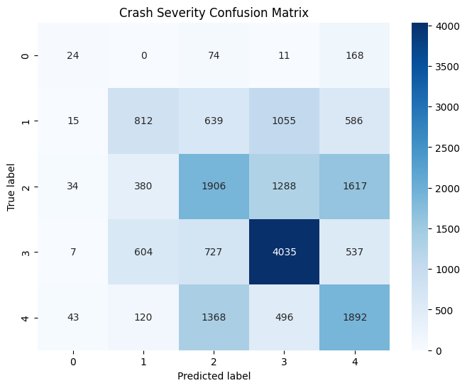

# Random Forest Regressor
A model using random forest classifier to predict the severity of road crashes in NSW.

## Project Overview
This project aims to predict the severity level of a road crash, for example, whether it will result in a Fatal, Serious Injury, Moderate Injury, Minor/Other Injury, or Non-casualty (towaway) outcome, using real-world crash data from NSW (2020–2024).

The model uses a range of factors including weather, lighting conditions, road geometry, speed limits, and time of day to assess crash outcomes.

The dataset contains approximately 100,000 records of reported crashes.

## Features Used
This code will split the data into these proportions:
- 60% training
- 20% validation
- 20% test

**We will exclude the following columns as features:**
- `CrashID`: no predictive meaning
- `DegreeOfCrash`: target
- `NoKilled`, `NoSeriouslyInjured`, `NoModeratelyInjured`, `NoMinorOtherInjured`: leakage
- `ReportingYear`, `YearOfCrash`: no predictive meaning
- `Distance`, `Direction`, `IdentifyingFeature`, `IdentifyingFeatureType`, `RouteNum`: Too specific, might add noise
- `Town`, `StreetOfCrash`: can use Latitude and Longitude instead

**We will use the following column as features of X to train and predict with:**
| Feature                                      | Rationale                                            |
| -------------------------------------------- | ---------------------------------------------------- |
| `MonthOfCrash`                               | Seasonal / weather effects                           |
| `DayOfWeekOfCrash`                           | Weekday vs weekend patterns                          |
| `TwoHourIntervals`                           | Time-of-day risk patterns                            |
| `SchoolZoneActive`                           | Speed restriction effects                            |
| `Urbanisation`                               | Rural vs urban crash differences                     |
| `ConurbationOne`                             | Broader regional context                             |
| `TypeOfLocation`                             | Roadway type (intersection, motorway, etc.)          |
| `SpeedLimit`                                 | Strongest predictor of crash severity                |
| `RoadClassificationAdmin`                    | Administrative road class (local, arterial, highway) |
| `Alignment`                                  | Straight vs curved geometry                          |
| `StreetLighting`                             | Lighting and visibility conditions                   |
| `RoadSurface`                                | Asphalt vs concrete traction differences             |
| `SurfaceCondition`                           | Wet, dry, icy, etc.                                  |
| `Weather`                                    | Rain, fog, fine conditions                           |
| `NaturalLighting`                            | Daylight, dusk, or dark                              |
| `SignalsOperation`                           | Presence of signalised intersection                  |
| `OtherTrafficControl`                        | Stop / give-way signs                                |
| `FirstImpactType`                            | Head-on, side, rear impact                           |
| `DCACode`, `DCADescription`, `DCASupplement` | Crash mechanism descriptors                          |
| `NoOfTrafficUnitsInvolved`                   | Number of vehicles — proxy for crash complexity      |

## Model Pipeline
To streamline training and preprocessing, a Scikit-Learn + imbalanced-learn Pipeline was created with the following stages:

1. Preprocessing
- Numerical features imputed using the median. 
- Categorical features imputed using most frequent value
- One-Hot Encoding applied to all categorical variables using ColumnTransformer

2. Balancing the Dataset
- The dataset was highly imbalanced (e.g. Fatal = 1.5% of samples).
- Applied SMOTE (Synthetic Minority Oversampling Technique) to generate synthetic examples for minority classes.

3. Model Training
Random Forest Classifier with tuned hyperparameters:
``` python
RandomForestClassifier(
    n_estimators=500,
    min_samples_split=5,
    min_samples_leaf=2,
    max_features='sqrt',
    random_state=42,
    class_weight='balanced_subsample'
) 
```
Training performed on the preprocessed and balanced dataset.

4. Evaluation
- Evaluated using accuracy, macro-averaged F1, weighted F1, and confusion matrix. 
- `f1_macro` used as the main performance metric to account for imbalance.

5. Results
| Metric       | Value |
| ------------ | ----- |
| Accuracy     | 47%   |
| Macro F 1    | 0.38  |
| Weighted F 1 | 0.46  |

The model performs best on Non-casualty and Moderate Injury crashes, but struggles with the rare Fatal class due to the inherent class imbalance in real-world crash data.

## Classification Report
| Class                  | Precision | Recall | F1-Score | Support |
| ---------------------- | --------- | ------ | -------- | ------- |
| Fatal                  | 0.20      | 0.09   | 0.12     | 277     |
| Minor/Other Injury     | 0.42      | 0.26   | 0.32     | 3107    |
| Moderate Injury        | 0.40      | 0.36   | 0.38     | 5225    |
| Non-casualty (towaway) | 0.59      | 0.68   | 0.63     | 5910    |
| Serious Injury         | 0.39      | 0.48   | 0.43     | 3919    |

## Confusion Matrix


The confusion matrix shows:
- Strong performance on Non-casualty (class 3)
- Moderate ability to distinguish between Moderate and Serious injuries
- Frequent confusion between Serious and Fatal due to limited Fatal samples and overlapping conditions.

## Interpretation 
- The model achieves almost 2.5× higher accuracy than random guessing (20%) for a 5-class problem.
- Macro-F1 = 0.38 indicates moderate class-level performance despite severe imbalance.
- The Fatal category remains challenging — largely due to data sparsity and feature overlap.
- Oversampling helped improve minority recall, but future improvements are needed for fine grained class differentiation.

## Tools and libraries
- Python 3.12
- `pandas`, `numpy`, `scikit-learn`, `imbalanced-learn`
- `seaborn`, `matplotlib` for visualization
- `joblib` for model saving

## Author
Shuheng Sun
[LinkedIn](https://www.linkedin.com/in/jerry-sun05/) · [GitHub](https://github.com/jerrysun-ofive)